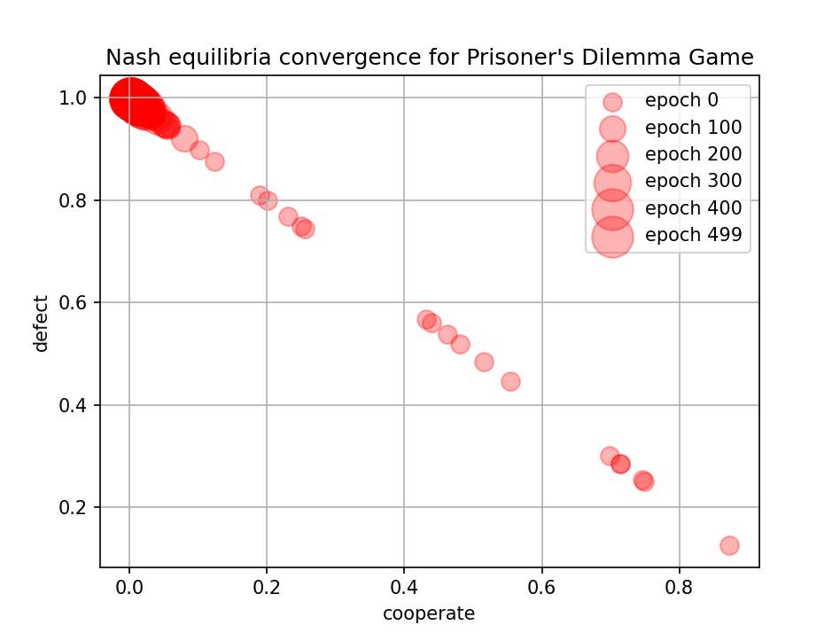
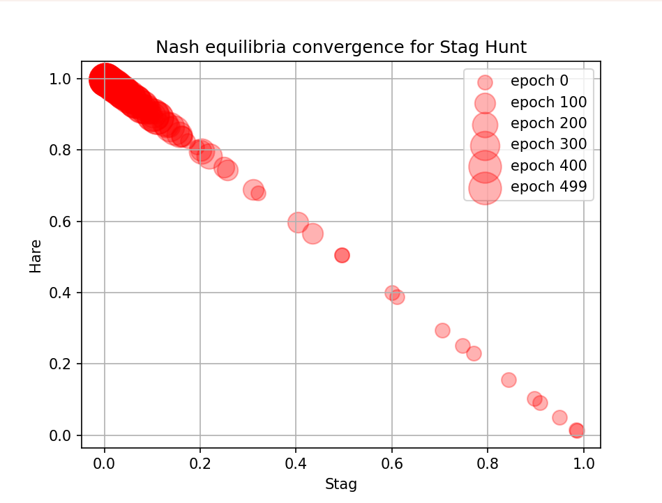
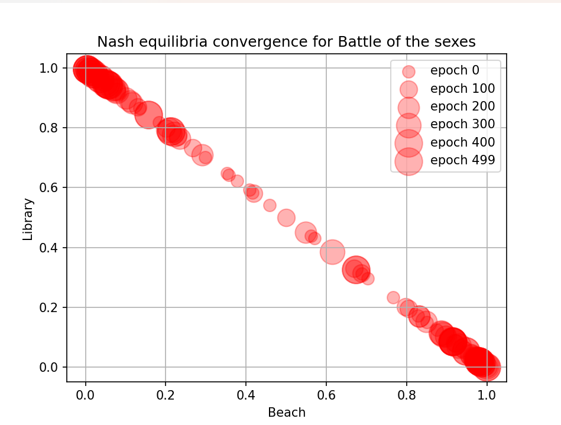
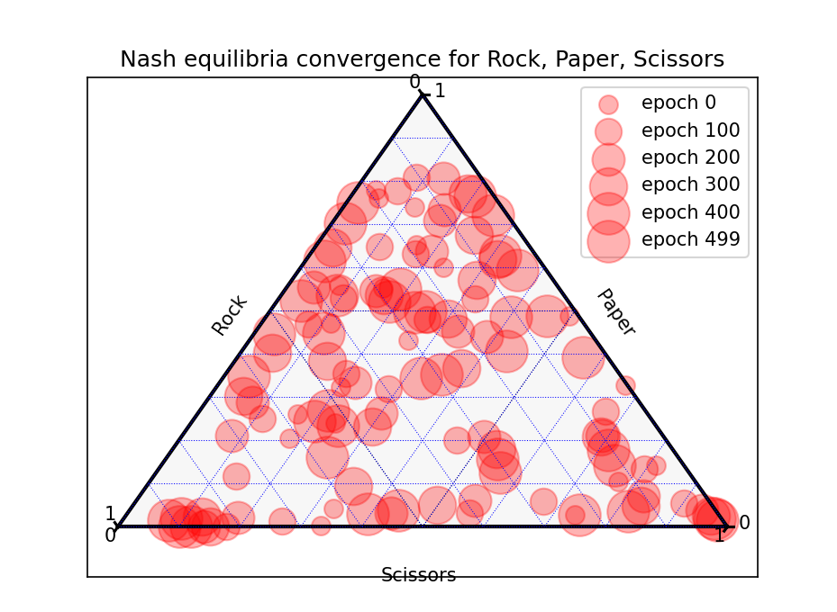

# Mod/Sim Fall 2025 Final Project: Nash Equilibria through Simulation

### Author: Jeffery Ji

### Date: 07/04/1776

This simulates 20 virtual players playing in a round robin tournament in a game you choose, and each player adjusts thier strategy as they win or lose. Eventually, it should converge to the Nash equilibria. The results are seen in a matplotlib graph, where the larger the circle, the longer it is in the simulation. Places with high density of large dots should be Nash equilibria.

To run the file, run it through the command line with the game file (.game) as an argument.
Example: python nash.py prisoners.game.

### Example output:

Prisoner's dilemma (prisoners.game):

Stag hunt: (stag.game) (this didn't work because the round robin format makes the stag-stag equilibrium unstable)

Battle of the sexes (sexes.game):

Rock, Paper, Scissors:

